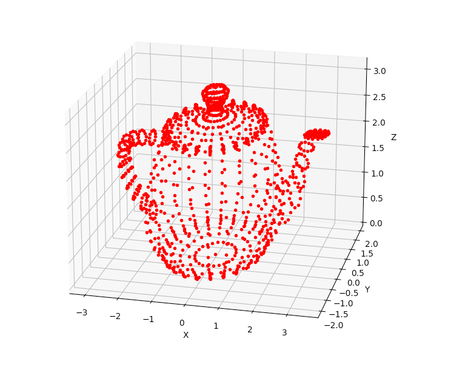

# Computer Graphics & Image Processing

**Assignment 1:** Image Projection.

&nbsp;

- **Objective One:** Place the camera at location [0, 0, 10] and perform the projection (the resulting 2D image can be found in the report). Explain why the entire object is not visible. Note that, only the pixels with positive coordinates are visible.

&nbsp;

- **Objective Two:** Modify the intrinsics matrix in order to capture an image with the resolution 1920 × 1080 pixels. Change the camera position and visually inspect the differences. Note that, c = [cx, cy] is where the optical axis intersects the image plane. This is usually in the center of the image plane and digital image coordinates are measured from the lower-left corner, these values are often well approximated with half the width and height of the image.

&nbsp;

Assignment One Grade Received: 100%